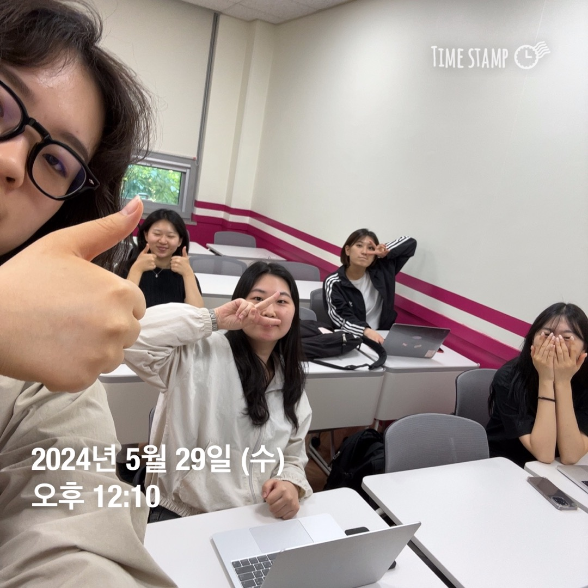

# [과제 예시] 2024 멋쟁이사자처럼 12th : 6차 세션 Read.md 문서 작성법 배우기

## 서비스 소개

#### 반갑습니다

#### 멋쟁이사자처럼 12기 아기사자 진, 승주, 은지, 경민과 함께하고 있는 파트장 이성경입니다.

#### 여러분의 실력을 마음껏 펼쳐보세요



<br>

## 실행 방법
```
#가상환경 설치
python -m venv venv (Window)
virtualenv -p python3 venv (Mac)

#가상환경으로 들어가기
.\venv\Scripts\activate (Window)
source venv/bin/activate (Mac)

#장고설치
pip install django~=3.2.10 

#마이그레이션
python manage.py makemigrations
python manage.py migrate

#가상환경 실행
python manage.py runserver

#가상환경 종료
ctrl + c
```

<br>

## 팀원 소개

<table border="" cellspacing="0" cellpadding="0" width="100%">
  <tr width="100%">
    <td align="center">성경</a></td>
    <td align="center">진</a></td>
    <td align="center">은지</a></td>
    <td align="center">경민</a></td>
    <td align="center">승주</a></td>
  </tr>
  <tr width="100%">
  <td align="center"></td>
  <td  align="center"></td>
  <td  align="center"></td>
    <td  align="center"></td>
  <td  align="center"></td>
  </tr>
  <tr width="100%">
  <td  align="center">기획/디자인</td>
    <td  align="center">기획/디자인</td>
  <td  align="center">기획/디자인</td>
  <td  align="center">기획/디자인</td>
    <td  align="center">기획/디자인</td>
     </tr>
      <tr width="100%">
     </tr>
  </table>

<br>

## 기술 스택

<span>Front End :</span> 
<span></span>
<span></span>
<span></span>

<span>Back End: </span>
<span></span>
<span></span>

<span>Environment: </span>
<span></span>
<span></span>
<span></span>
<span></span>

<span>Communication: </span>
<span></span>
<span></span>

<span>Design: </span>
<span></span>

<br>

## 화면 구성


<br>

## API 명세서


<br>

## 폴더 구조

  ```
📂 all_project
└─yuyong
├─ yuyong
│  ├─ **init**.py
│  ├─ [asgi.py](http://asgi.py/)
│  ├─ [settings.py](http://settings.py/)
│  ├─ [urls.py](http://urls.py/)
│  └─ [wsgi.py](http://wsgi.py/)
├─ post
│  ├─ **init**.py
│  ├─ [admin.py](http://admin.py/)
│  ├─ [apps.py](http://apps.py/)
│  ├─ [models.py](http://models.py/)
│  ├─ [tests.py](http://tests.py/)
│  ├─ urls.py

│  ├─ forms.py

│  └─ [views.py](http://views.py/)

├─ qna
│  ├─ **init**.py
│  ├─ [admin.py](http://admin.py/)
│  ├─ [apps.py](http://apps.py/)
│  ├─ [models.py](http://models.py/)
│  ├─ [tests.py](http://tests.py/)
│  ├─ urls.py

│  ├─ forms.py

│  └─ [views.py](http://views.py/)

├─ user
│  ├─ **init**.py
│  ├─ [admin.py](http://admin.py/)
│  ├─ [apps.py](http://apps.py/)
│  ├─ [models.py](http://models.py/)
│  ├─ [tests.py](http://tests.py/)
│  ├─ urls.py

│  ├─ forms.py

│  └─ [views.py](http://views.py/)
└─ [manage.py](http://manage.py/)
  ```

